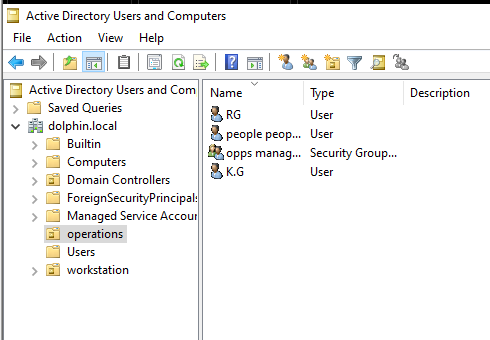
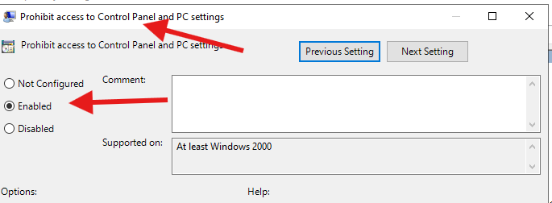
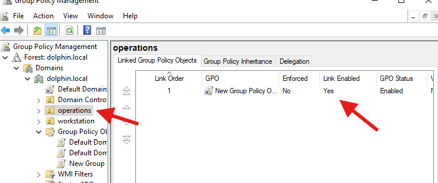
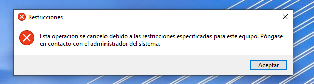
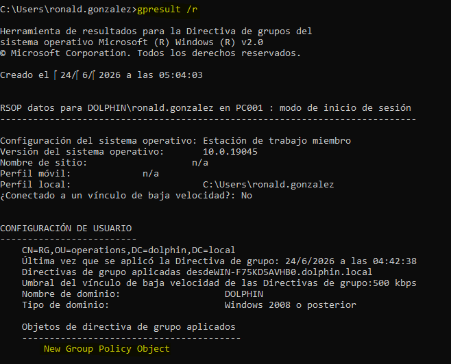
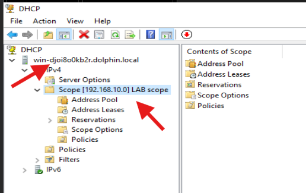
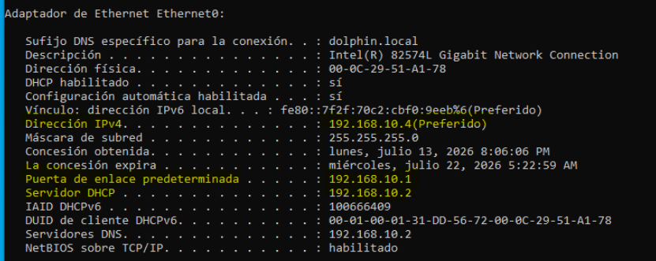

# Active Directory Lab

## Overview

This project documents my hands-on experience building and managing an Active Directory environment using Windows Server 2022 and VMware Workstation.

## Objectives

- Deploy a Windows Server 2022 Domain Controller
- Configure Active Directory Domain Services (AD DS)
- Create and manage users and groups
- Configure DNS and DHCP
- Join Windows clients to the domain
- Apply Group Policies (GPOs)
- Practice troubleshooting common Active Directory issues

## Lab Environment

### Virtual Machines

| Machine | Operating System | Purpose |
|----------|----------|----------|
| DC01 | Windows Server 2022 | Domain Controller |
| CLIENT01 | Windows 11 | Domain Client |
| CLIENT02 | Windows 11 | Domain Client |

## Technologies Used

- VMware Workstation
- Windows Server 2022
- Active Directory
- DNS
- DHCP
- Group Policy
- Windows 11

## Implemented Tasks

- [x] Install Windows Server 2022
- [x] Configure Static IP
- [x] Install Active Directory Domain Services
- [x] Promote Server to Domain Controller
- [x] Create Organizational Units
- [x] Configure Group Policies
- [x] Configure DHCP
- [x] Add Additional Clients

## Screenshots

## Domain Controller

The server was promoted to a Domain Controller using Active Directory Domain Services (AD DS). The domain was configured to manage users, groups, and authentication within the lab environment.

## Group Policy

Configured a Group Policy setting to prevent users from accessing Control Panel and Windows Settings.

## Group Linked

Linked the Group Policy Object (GPO) to the Operations Organizational Unit to enforce policy settings for targeted users.

## Group Restriction verified

Verified successful policy enforcement by logging in as a domain user and confirming that access to Control Panel was restricted.

Verified successful GPO deployment using the gpresult command. The output confirmed that the Group Policy Object was applied to the target user account, validating that the policy settings were being enforced correctly.

## DHCP Configuration

The DHCP server has been configured with an active IPv4 scope named LAB scope for the 192.168.10.0/24 network. This scope is responsible for automatically assigning IP addresses and network settings to client computers joined to the domain

After activating the scope, Windows clients successfully received IP addresses within the configured range (192.168.10.4 - 192.168.10.54) and automatically obtained the appropriate DNS and gateway settings from the DHCP server.

## Lessons Learned

This lab has helped me understand how Active Directory, DNS, users, groups, and domain-joined computers work together in a Windows enterprise environment.
